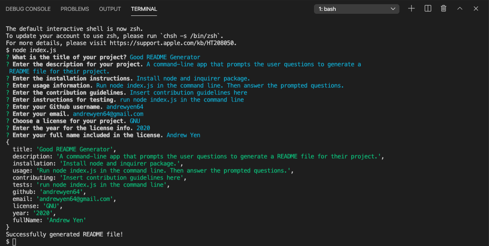
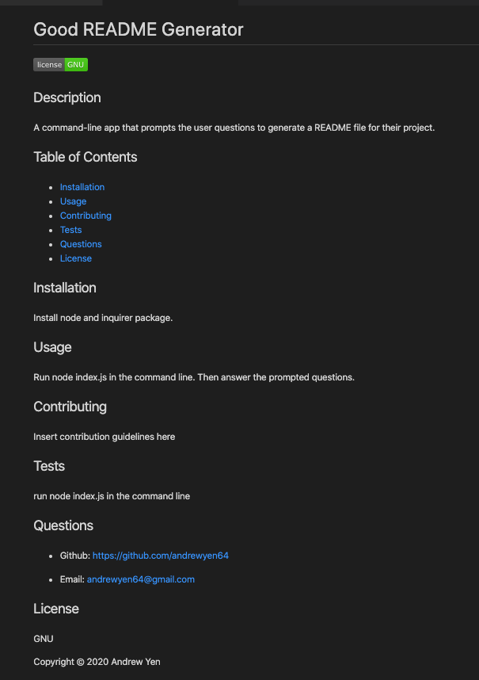

# Good README Generator

## Description

A command-line application that prompts the user multiple questions to generate a README.md that includes a Title, Description, Table of Contents, Installation, Usage, Contributing, Tests, Questions, and/or License sections for their project.

## Table of Contents

* [Installation](#Installation)
* [Usage](#Usage)
* [Questions](#Questions)
* [License](#License)

## Installation

Install node.js and the inquirer package with npm install.

## Usage

Run "node index.js" in the command line. Then answer the prompted questions.

* Link to video walkthrough: <https://youtu.be/5xxy8SQmYjU>

Demo Image after running application and answering questions:

Example of Generated README file:

## Questions

* Github: <https://github.com/andrewyen64>

If you have any questions, send me a message:

* Email: andrewyen64@gmail.com

## License

GNU License

Copyright © 2020 Andrew Yen
